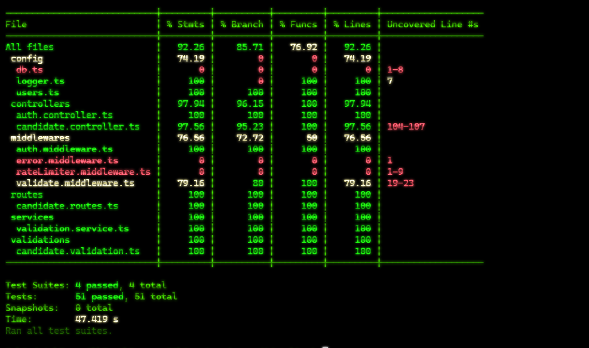
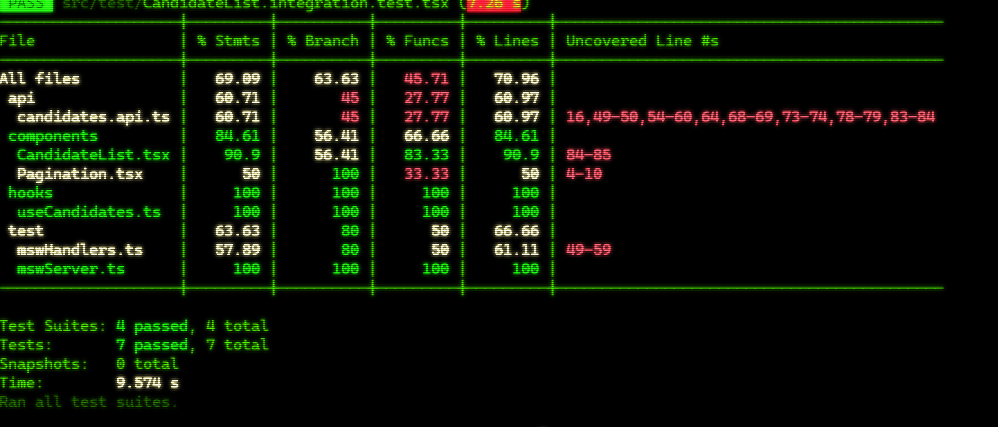
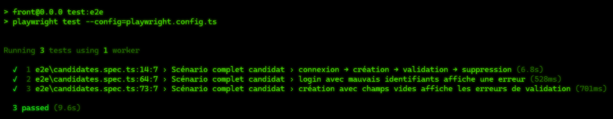
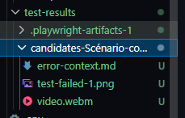
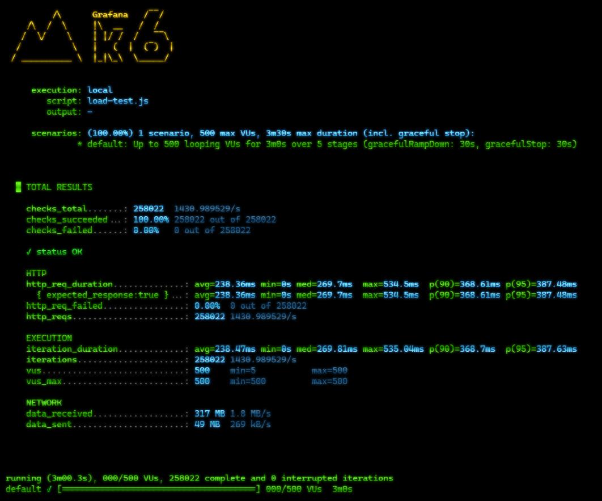

# Gestion de candidats
Lien render: https://gestion-de-candidats-front.onrender.com
email: admin@mail.com
password: admin

## Structure du projet
- `back/`
  - `src/` : code serveur, routes, contrôleurs, middlewares, modèles
  - `tests/` : tests unitaires et d'intégration pour le backend
  - `package.json` : dépendances backend et scripts de test
- `front/`
  - `src/` : application React, pages, composants, hooks, API
  - `e2e/` : tests Playwright end-to-end
  - `package.json` : dépendances frontend et scripts de test


## Installation
1. Ouvrir un terminal à la racine du projet.
2. Installer les dépendances backend :
   ```powershell
   cd back
   npm install
   npm run dev
   ```
3. Installer les dépendances frontend :
   ```powershell
   cd front
   npm install
   npm run dev
   ```

# Ou
docker-composer up


## Stratégie de test détaillée

### 1. Tests unitaires
Objectif : vérifier chaque unité de code isolée.

- Backend : tester les services, validations, modèles et utilitaires dans `back/tests/`


- Frontend : tester les composants, hooks et fonctions utilitaires dans `front/src/test/`


### 2. Tests d'intégration backend
Objectif : vérifier le comportement de plusieurs composants ensemble.

- `back/tests/integration/` couvre les routes de l'API et la connexion à la base de données de test
- vérifier les opérations CRUD principales sur les candidats
- tester les middlewares d'authentification et de validation

### 3. Tests end-to-end (E2E)
Objectif : valider l'application depuis l'interface utilisateur finale.

- `front/e2e/` couvre les parcours principaux via Playwright
- vérifier :
  - chargement de la liste des candidats
  - création d'un candidat
  - édition d'un candidat
  - navigation entre les pages
  - gestion des erreurs et états de chargement



# Capture d'écran en cas d'erreur



## Commandes de test

### Backend
npm test

### Frontend
npm test
npm run test:e2e


# Test k6
